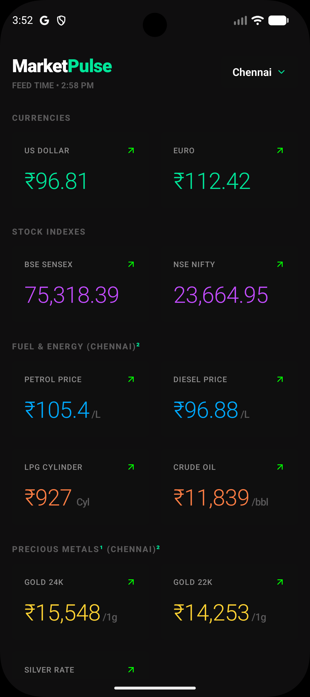

# MarketPulse

A React Native (Expo) mobile app for tracking real-time Indian market data — currencies, stock indices, fuel prices, precious metals, and luxury assets — with city-specific regional pricing.

---

## Screenshots

<p align="center">
  
  &nbsp;&nbsp;&nbsp;&nbsp;
  
</p>
<p align="center">
  <sub>Splash Screen &nbsp;&nbsp;&nbsp;&nbsp;&nbsp;&nbsp;&nbsp;&nbsp;&nbsp;&nbsp;&nbsp;&nbsp;&nbsp;&nbsp;&nbsp;&nbsp;&nbsp;&nbsp;&nbsp;&nbsp;&nbsp; Home Dashboard (Chennai)</sub>
</p>

---

## Features

- **Live Forex Rates** — USD/INR and EUR/INR from ExchangeRate API
- **Stock Indices** — BSE Sensex and NSE Nifty via Yahoo Finance
- **Fuel & Energy** — City-specific petrol, diesel, LPG, and crude oil prices
- **Precious Metals** — Gold (24K/22K), Silver, and Platinum with live international spot prices from GoldAPI, adjusted for Indian customs duty, AIDC levies, and 3% GST
- **Luxury Assets** — Diamond rates per carat and Platinum per gram
- **City Switching** — Regional pricing for Chennai, Mumbai, Delhi, Kolkata, and Bengaluru
- **Smart Caching** — AsyncStorage-backed caching; stocks refresh only during market hours (9 AM–5 PM), metals refresh once per calendar day
- **Force Sync** — Manual refresh button to bypass cache and pull fresh data
- **Trend Indicators** — Each metric card shows a directional arrow (up/down) compared to baseline market reference values
- **Dark UI** — Full dark mode with a minimal, high-contrast design

---

## Project Structure

```
dynamic-tracker/
├── App.tsx                        # Root component — layout, state, city selection modal
├── index.ts                       # Expo entry point
├── app.json                       # Expo app config (name, icons, bundle IDs)
├── eas.json                       # EAS Build config (dev / preview / production)
├── package.json
├── tailwind.config.js             # NativeWind/Tailwind config
├── global.css                     # Global CSS (NativeWind base import)
├── globals.d.ts                   # TypeScript global declarations
├── metro.config.js                # Metro bundler config
├── .env                           # API keys (not committed)
├── assets/                        # App icons and splash screens
└── src/
    ├── components/
    │   └── MetricCard.tsx         # Reusable metric display card with trend indicator
    ├── services/
    │   └── apiService.ts          # All API calls, caching logic, and data computation
    └── types/
        └── tracker.ts             # TypeScript interfaces — GlobalMetrics, LocalMetrics, TargetCity
```

---

## Tech Stack

| Technology | Version | Purpose |
|---|---|---|
| Expo | ~54.0.33 | React Native framework |
| React | 19.1.0 | UI library |
| React Native | 0.81.5 | Mobile runtime |
| NativeWind | ^4.0.36 | Tailwind CSS for React Native |
| Tailwind CSS | ^3.4.1 | Utility-first styling |
| AsyncStorage | 2.2.0 | Local data caching |
| react-native-reanimated | ~4.1.1 | Animations |
| react-native-safe-area-context | ~5.6.0 | Safe area insets |
| TypeScript | ~5.9.2 | Type safety |

---

## External APIs

### 1. ExchangeRate API
- **Endpoint:** `https://v6.exchangerate-api.com/v6/{API_KEY}/latest/INR`
- **Used for:** USD/INR and EUR/INR conversion rates
- **Env var:** `EXPO_PUBLIC_EXCHANGE_RATE_API_KEY`

### 2. GoldAPI
- **Endpoint:** `https://www.goldapi.io/api/{symbol}/INR`
- **Symbols:** `XAU` (Gold), `XAG` (Silver), `XPT` (Platinum)
- **Used for:** International spot prices in INR, with Indian market adjustment factor applied (`× 1.105` for gold, `× 1.22` for silver, `× 1.15` for platinum)
- **Env var:** `EXPO_PUBLIC_GOLD_API_KEY`

### 3. Yahoo Finance (via allorigins proxy)
- **Symbols:** `^BSESN` (BSE Sensex), `^NSEI` (NSE Nifty)
- **Used for:** Live stock index prices
- **No API key required**

> All APIs have graceful fallback to hardcoded baseline values if the network call fails.

---

## Getting Started

### Prerequisites

- Node.js 18+
- Expo CLI (`npm install -g expo-cli`)
- An [ExchangeRate API](https://www.exchangerate-api.com/) account (free tier works)
- A [GoldAPI](https://www.goldapi.io/) account

### Installation

```bash
git clone <repo-url>
cd dynamic-tracker
npm install
```

### Environment Setup

Create a `.env` file in the root directory:

```env
EXPO_PUBLIC_EXCHANGE_RATE_API_KEY=your_exchangerate_api_key
EXPO_PUBLIC_GOLD_API_KEY=your_goldapi_key
```

### Running the App

```bash
# Start Expo dev server
npm start

# Android
npm run android

# iOS
npm run ios

# Web
npm run web
```

---

## Core Architecture

### Data Flow

```
App.tsx
  └── loadTrackerData(city, forceRefresh)
        └── getTrackerData() [apiService.ts]
              ├── fetchLiveStocksAndForex()   → GlobalMetrics (USD, EUR, Sensex, Nifty)
              └── fetchLiveMetalSpot()         → LocalMetrics (Gold, Silver, Platinum)
                    └── Compute city-adjusted local data (fuel + metals)
```

### Caching Strategy

| Data Type | Cache Duration | Key |
|---|---|---|
| Forex + Stocks | Same market session (refreshes at 9 AM and 5 PM boundaries) | `@market_pulse:global_data` |
| Gold (XAU) | Once per calendar day | `@market_pulse:metal_raw_XAU_*` |
| Silver (XAG) | Once per calendar day | `@market_pulse:metal_raw_XAG_*` |
| Platinum (XPT) | Once per calendar day | `@market_pulse:metal_raw_XPT_*` |

Force Sync clears all metal caches and re-fetches everything.

### City Variance Engine

Precious metal prices are adjusted per city using two mechanisms:

1. **Metal offset** — a fixed per-gram offset (`Chennai: +15`, `Mumbai: +25`, `Delhi: 0`, `Kolkata: -10`, `Bengaluru: +5`)
2. **Forex fluctuation ratio** — `usdToInr / 83.5` applied as a multiplier to fuel prices, keeping them reactive to currency movement

### Precious Metal Pricing Methodology

International spot prices (USD/troy oz) are converted using:

- Import from GoldAPI in INR denomination
- Multiplied by an **Indian Market Factor**:
  - Gold: `× 1.105` (accounts for 10% basic customs duty + 2.5% AIDC + 3% GST)
  - Silver: `× 1.22`
  - Platinum: `× 1.15`
- City offset added for regional dealer premiums

---

## Components

### `MetricCard`

A reusable card displaying a single financial metric.

| Prop | Type | Description |
|---|---|---|
| `label` | `string` | Metric name (e.g., "US Dollar") |
| `value` | `number` | Current metric value |
| `unit` | `string?` | Unit suffix (e.g., "/L", "/kg") |
| `accentColor` | `string?` | Accent color for the value text |
| `isPoints` | `boolean?` | If true, omits the ₹ prefix (for stock indices) |
| `subValue` | `string?` | Optional secondary text line |

Trend direction is computed by comparing `value` against `BASELINE_MARKET_CLOSES` reference values hardcoded in the component.

---

## Build & Deployment

This project uses [EAS Build](https://docs.expo.dev/build/introduction/).

```bash
# Install EAS CLI
npm install -g eas-cli

# Login to Expo
eas login

# Build for Android (internal preview)
eas build --platform android --profile preview

# Build for production
eas build --platform all --profile production
```

Build profiles defined in `eas.json`:
- **development** — development client, internal distribution
- **preview** — internal distribution (APK/IPA for testing)
- **production** — auto-increments version, targets app stores

---

## Supported Cities

| City | Petrol (₹/L) | Diesel (₹/L) | LPG (₹/Cyl) |
|---|---|---|---|
| Chennai | 104.57 | 96.11 | 912.50 |
| Mumbai | 107.59 | 94.08 | 902.50 |
| Delhi | 98.64 | 91.58 | 903.00 |
| Kolkata | 109.70 | 96.07 | 929.00 |
| Bengaluru | 107.12 | 95.04 | 905.50 |

> Displayed prices are forex-adjusted approximations for retail informational purposes. Final OTC prices may vary by local dealer premiums and state-level levies.

---

## Disclaimer

All values displayed are high-fidelity approximations for informational tracking purposes only. Final transaction prices will vary based on:
- Localized bullion dealer premiums
- Jeweler making charges
- State-specific taxes and levies
- Real-time market microstructure

This app is not a financial advisory tool.
